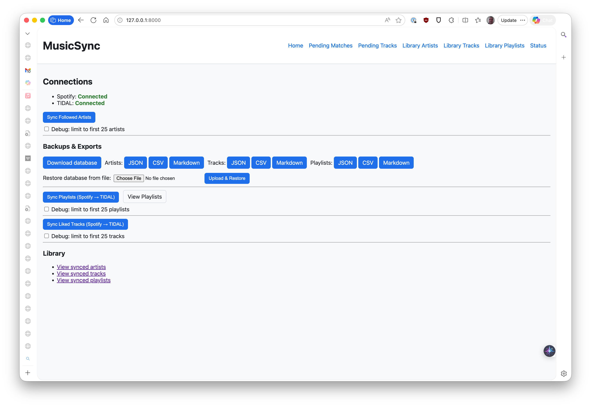
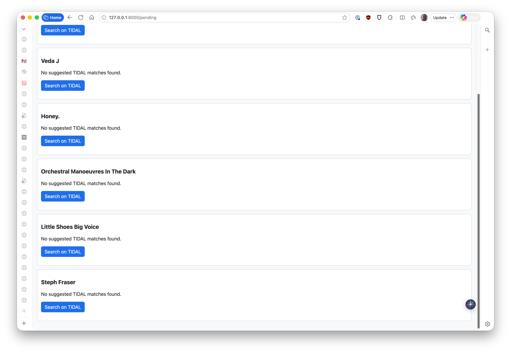
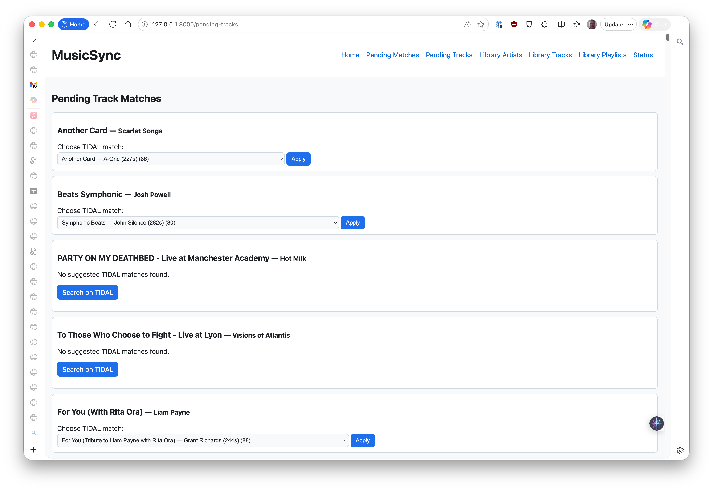
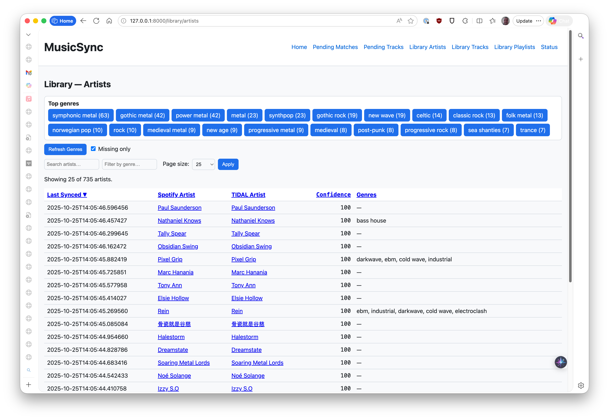
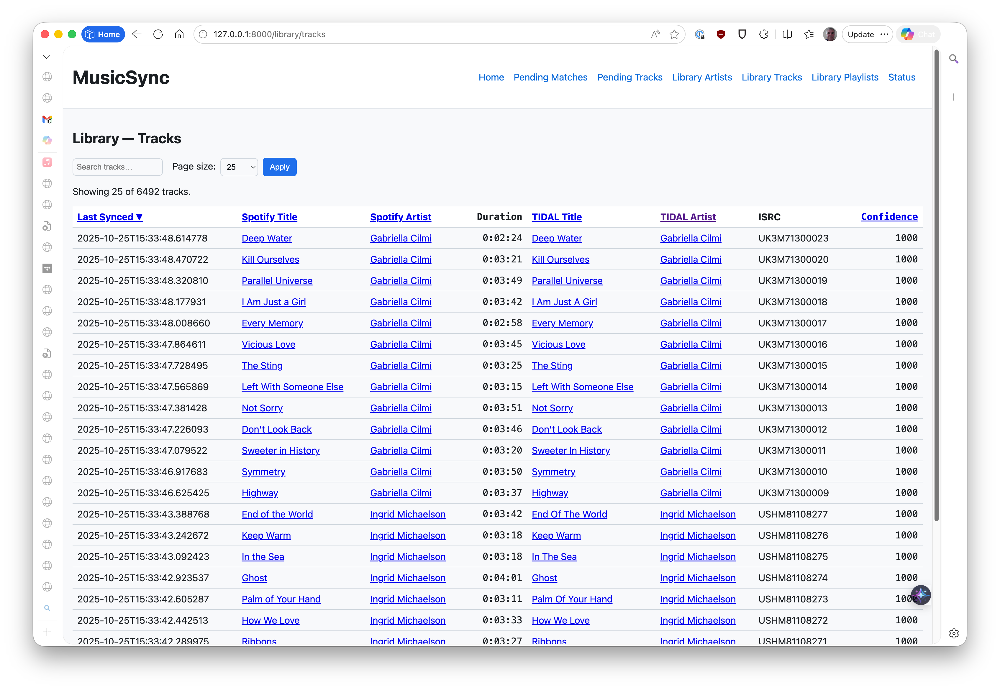
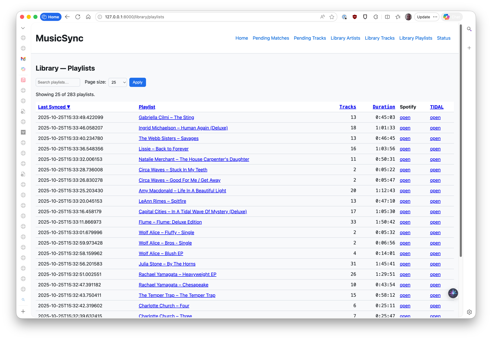
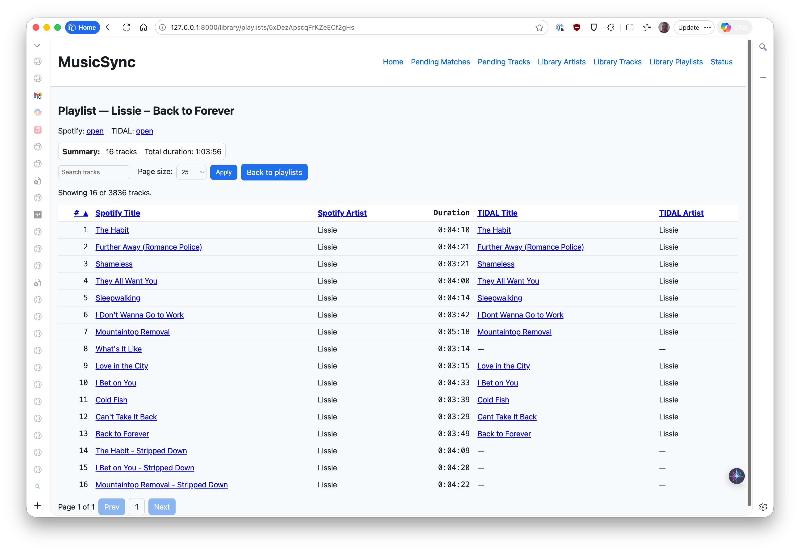
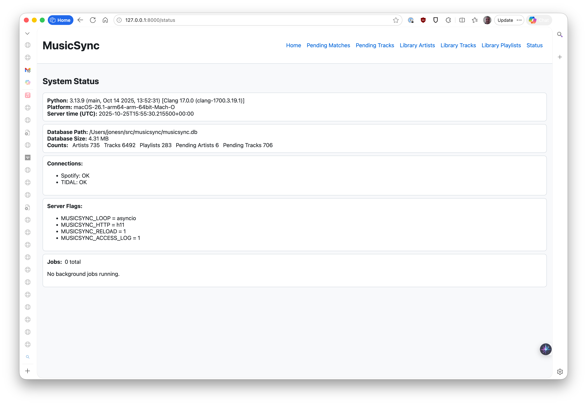

# MusicSync Screenshots & Feature Tour

This quick tour walks through the core screens and shows what MusicSync can do.
Each screenshot is taken directly from the app.

> Tip: Start the app, connect Spotify and TIDAL, then kick off syncs from the
> home page. Use the Status page to monitor environment and job progress.

## 1) Home / Index

Connect your accounts and run syncs with progress polling. Buttons start
background jobs; progress is shown inline and on the Status page.

- Connect Spotify (OAuth) and TIDAL (device login)
- Start syncs: Followed Artists, Liked Tracks, and Playlists
- See quick connection status indicators

## 2) Status / Diagnostics

A compact dashboard with environment, DB size, job snapshots, and basic
connectivity checks. Useful when running in low-resource environments.

- Python/platform info and environment flags
- Database size and basic counts
- Background jobs snapshot

## 3) Sync Artists Progress

Background job for followed artists. Loads followed artists from Spotify,
matches to TIDAL with normalization + fuzzy scoring, and updates favorites.

- Progress counters (processed, auto-matched, pending)
- Robust matching: exact/normalized match preference, fuzzy fallback
- Idempotent updates of TIDAL favorites

## 4) Pending Artists

Ambiguous artist matches get queued for manual resolution. Pick the correct
TIDAL artist and the mapping is saved.

- Candidate list with names and confidence
- On resolve, favorites are updated and a sync event is recorded

## 5) Pending Tracks

Similar to artists, ambiguous track matches can be resolved manually. ISRC is
preferred automatically when available.

- Tracks show title/artist and ranked candidates
- Accepting a candidate updates favorites and the track map

## 6) Library: Artists

Browse all synced artists with search, sorting, pagination, and a Top Genres
widget. You can also filter by genre.

- Search and sort (including genres)
- Top Genres summary and quick filters

## 7) Library: Tracks

Browse synced tracks with search/sort/pagination. ISRC-first mappings are
recorded, with fallbacks captured in the track map.

- Search by title/artist
- See mapped TIDAL info when available

## 8) Library: Playlists

Shows your user-owned Spotify playlists synced to TIDAL. Displays per-playlist
track count and total runtime; click a playlist to view its ordered snapshot.

- Sort by updated time, track count, or total duration
- Per-playlist detail view shows the ordered track list with durations

---

## What the app does, at a glance

- Followed artists → TIDAL favorites (auto-match, manual resolve when needed)
- Liked tracks → TIDAL favorites (ISRC-first; fuzzy fallback)
- User-owned playlists → TIDAL playlists (creates or reuses; adds missing tracks)
- Library pages to browse synced content, plus exports and database backup
- Background jobs with progress and a Status page for quick diagnostics

For deeper architecture details, see [AGENTS.md](../AGENTS.md). For playlist
specifics, see [PLAYLISTS.md](PLAYLISTS.md).
